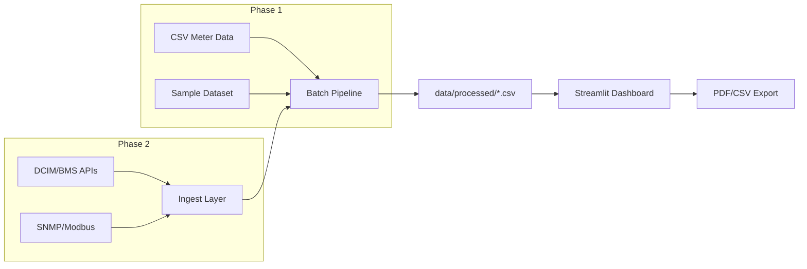

# InfraPulse 2.0 — Data Center Power & Expenditure Platform Plan

## Goal

Replace the placeholder README in [AJ-ing/InfraPulse_2.0](https://github.com/AJ-ing/InfraPulse_2.0) with a full project plan and architecture document. The repo is currently empty (LICENSE + 16-byte README). This plan defines what that README will contain and how the platform will be built.

**Relationship to InfraPulse v1:** [InfraPulse](https://github.com/AJ-ing/InfraPulse) is a Streamlit-based infrastructure asset decision-support system (bridge risk scoring). InfraPulse 2.0 reuses the same proven pattern—batch pipeline writes processed CSVs, read-only Streamlit dashboard consumes them—but pivots the domain from physical asset risk to **data center energy efficiency and cost optimization**.

---

## Problem Statement (README intro)

Data centers consume 1–3% of global electricity. Facility operators must answer:

- How efficient is each site? (**PUE**)
- How much are we spending on power, and where is waste? (**expenditure breakdown**)
- How much could we save by improving cooling, UPS efficiency, or IT load? (**savings scenarios**)

InfraPulse 2.0 is a transparent, explainable decision-support tool—no black-box ML—mirroring the methodology-first approach of v1.

---

## Core Metrics & Formulas

| Metric | Formula | Notes |
|--------|---------|-------|
| **PUE** | `Total Facility Energy / IT Equipment Energy` | ISO/IEC 30134-2; lower is better; ideal = 1.0 |
| **DCiE** | `(1 / PUE) × 100` | Percentage of energy going to IT |
| **Overhead Energy** | `Total Energy − IT Energy` | Cooling, UPS losses, lighting, etc. |
| **Energy Cost** | `kWh × tariff_rate` | Per facility, per period |
| **Carbon (optional)** | `kWh × grid_emission_factor` | Phase 2 |
| **Savings Potential** | `(current_PUE − target_PUE) × IT_load_kWh × tariff` | Annualized |

**PUE measurement categories** (ENERGY STAR / Green Grid):

- **PUE1** — instantaneous power (kW)
- **PUE2** — energy over 12 months (kWh) — primary reporting metric
- **PUE3** — energy over 12 months, all energy sources weighted

Phase 1 implements PUE1 and PUE2 from CSV meter readings.

**Industry benchmarks** (for savings context):

- Uptime Institute average PUE: ~1.59
- Hyperscale leaders: 1.1–1.2
- Legacy enterprise: 1.8–2.0+

---

## Architecture

Same minimal, auditable pattern as v1:



### Proposed repo structure

```
InfraPulse_2.0/
├── data/
│   ├── sample/                          # bundled demo: 3–5 fictional DCs, 12 months
│   │   ├── facilities.csv               # site metadata (name, region, IT capacity MW)
│   │   └── meter_readings.csv           # timestamp, facility_id, meter_type, kWh
│   ├── reference/
│   │   ├── tariffs.csv                  # region → $/kWh
│   │   └── benchmarks.csv               # industry PUE targets by facility class
│   └── processed/
│       ├── facilities_energy.csv        # pipeline output: per-facility aggregates
│       └── savings_scenarios.csv        # what-if scenario results
├── pipeline/
│   ├── ingest_meters.py                 # validate + normalize raw meter CSVs
│   ├── compute_pue.py                   # PUE1/PUE2 by facility and period
│   ├── compute_costs.py                 # energy cost + overhead breakdown
│   ├── savings_scenarios.py             # target PUE → $ saved
│   ├── scoring_logic.py                 # shared formulas (testable, like v1)
│   └── run_pipeline.py                  # orchestrator CLI
├── pages/
│   ├── home.py                          # portfolio KPIs + headline stats
│   ├── portfolio.py                     # multi-facility comparison table + map
│   ├── facility.py                      # single-site drill-down (PUE trend, cost)
│   ├── savings.py                       # savings analyzer + recommendations
│   ├── sandbox.py                       # what-if: adjust PUE target, tariff, IT load
│   └── methodology.py                   # formulas, data sources, limitations
├── utils/
│   └── pdf_export.py                    # facility/portfolio report export (reuse v1 pattern)
├── tests/
│   └── test_pipeline.py                 # unit tests for PUE/cost/savings formulas
├── streamlit_app.py                     # navigation entrypoint
├── data_loader.py                       # single source of truth for loading processed data
├── requirements.txt
├── .streamlit/config.toml
└── README.md                            # this plan, fully written out
```

---

## Data Model

### `facilities.csv`

| Column | Type | Description |
|--------|------|-------------|
| `facility_id` | str | Unique ID |
| `name` | str | e.g. "Melbourne DC-1" |
| `region` | str | For tariff lookup |
| `it_capacity_mw` | float | Design IT load |
| `facility_class` | str | hyperscale / enterprise / edge / colo |
| `lat`, `lon` | float | Optional, for portfolio map |

### `meter_readings.csv`

| Column | Type | Description |
|--------|------|-------------|
| `timestamp` | datetime | Reading time |
| `facility_id` | str | FK to facilities |
| `meter_type` | enum | `facility_total`, `it_load`, `cooling`, `ups_loss`, `lighting`, `other` |
| `value_kwh` | float | Energy consumed in period |
| `value_kw` | float | Optional instantaneous power |

**Minimum viable input:** `facility_total` + `it_load` per timestamp. Sub-meter types enable overhead breakdown and targeted savings recommendations.

### Pipeline outputs

**`facilities_energy.csv`** — one row per facility per period (month):

- `pue`, `dcie`, `total_kwh`, `it_kwh`, `overhead_kwh`
- `energy_cost_usd`, `overhead_cost_usd`
- `pue_tier` (excellent / good / average / poor, based on benchmarks)

**`savings_scenarios.csv`** — one row per facility per target PUE:

- `target_pue`, `annual_savings_usd`, `annual_kwh_saved`, `payback_notes`

---

## Streamlit Pages

Mirroring v1 navigation (`streamlit_app.py` with `st.navigation`):

### 1. Home
- Portfolio headline KPIs: avg PUE, total annual energy cost, total potential savings
- "Top 5 least efficient facilities" callout
- Link to live demo (Streamlit Cloud, post-deploy)

### 2. Portfolio
- Filterable table: all facilities ranked by PUE (worst first)
- Color-coded PUE tier (colorblind-safe palette, text labels)
- Optional map view (reuse v1 map pattern with facility markers)
- Sparkline PUE trend per row

### 3. Facility Drill-down
- Select facility → 12-month PUE trend chart
- Energy cost breakdown: IT vs cooling vs UPS vs other
- Overhead pie chart
- Comparison to industry benchmark for facility class

### 4. Savings Analyzer
- Per facility: current PUE → target PUE slider
- Live calculation: annual $ saved, kWh saved, % overhead reduction
- Recommendation cards based on overhead breakdown:
  - High cooling share → "Consider hot/cold aisle containment, CRAC optimization"
  - High UPS share → "Evaluate high-efficiency UPS modes (e.g. eco mode)"
  - High IT share → "Workload consolidation / virtualization"

### 5. What-If Sandbox (reuse v1 sandbox pattern)
- Adjust: tariff rate, IT load growth %, target PUE
- See portfolio-wide impact on cost and savings in real time

### 6. Methodology
- PUE formula and measurement categories
- Cost calculation assumptions
- Savings formula derivation
- Data sources and known limitations
- Citations: ISO/IEC 30134-2, ENERGY STAR DC Metrics Task Force

---

## Phased Roadmap

### Phase 1 — CSV + Sample Data (MVP)
- Bundle sample dataset (3–5 facilities, 12 months)
- Batch pipeline: ingest → PUE → cost → savings
- Full Streamlit dashboard (6 pages above)
- Unit tests for all formulas
- Deploy to Streamlit Community Cloud
- **Deliverable:** working demo with no external dependencies

### Phase 2 — User Data Import
- CSV upload UI in Streamlit (validate schema, run pipeline on upload)
- Tariff configuration page (user-defined $/kWh by region)
- PDF export for facility and portfolio reports

### Phase 3 — Live Integrations (designed for, not built in MVP)
- Abstract `ingest_meters.py` behind a plugin interface:
  - `CsvIngestor` (Phase 1)
  - `DcimApiIngestor` (Schneider, Sunbird, Nlyte)
  - `SnmpIngestor` (PDU/UPS SNMP OIDs)
- Scheduled pipeline runs (cron / GitHub Actions)
- Real-time PUE1 dashboard tile

### Phase 4 — Advanced Analytics
- Carbon emissions tracking (grid emission factors by region)
- ML anomaly detection on meter readings (flag unusual PUE spikes)
- CapEx/OpEx ROI calculator for efficiency investments

---

## Tech Stack

| Layer | Choice | Rationale |
|-------|--------|-----------|
| Language | Python 3.11+ | Same as v1 |
| Dashboard | Streamlit | Proven in v1, fast iteration |
| Data processing | pandas | Same as v1 pipeline |
| Charts | Plotly (via Streamlit) | Interactive time-series |
| Tests | pytest | Same as v1 |
| CI | GitHub Actions | Reuse v1 `.github/workflows/tests.yml` pattern |
| Deploy | Streamlit Community Cloud | Same as v1 demo |

**Dependencies** (initial `requirements.txt`):

```
streamlit>=1.32
pandas>=2.0
plotly>=5.0
pytest>=7.0
```

---

## Sample Data Strategy

Generate a realistic synthetic dataset for demo:

- **5 facilities** across AU regions (Melbourne, Sydney, Perth, Brisbane, Adelaide)
- **Facility classes:** 1 hyperscale (PUE ~1.15), 2 enterprise (PUE ~1.6–1.8), 1 edge (PUE ~1.4), 1 legacy (PUE ~2.1)
- **12 months** of monthly meter readings with seasonal cooling variation
- **Tariffs** from AU average industrial rates (~$0.12–0.18/kWh by state)

This lets the savings analyzer show meaningful variance without requiring real meter access.

---

## Key Design Principles (carried from v1)

1. **Transparent formulas** — every number on screen traces to a documented formula, not a black box
2. **Pipeline/app separation** — app is read-only; all computation happens in batch pipeline
3. **Explainability over prediction** — rule-based recommendations, not ML-first
4. **Methodology page is first-class** — not an afterthought
5. **Colorblind-safe UI** — PUE tiers use color + text label
6. **No cloud lock-in** — runs locally with zero external API calls in Phase 1

---

## README Sections to Write

When approved, the README will be structured as:

1. **Title + tagline** — "Data Center Power Usage & Expenditure Platform"
2. **Problem statement** — why PUE and cost visibility matter
3. **Key features** — bullet list (portfolio view, PUE calc, savings analyzer, sandbox, methodology)
4. **Screenshots** — placeholder sections until UI is built
5. **Architecture diagram** — repo tree + data flow
6. **Core metrics** — PUE, DCiE, cost, savings formulas
7. **Data model** — input CSV schemas
8. **Getting started** — clone, install, run pipeline, launch app
9. **Phased roadmap** — Phase 1–4 as above
10. **Relationship to InfraPulse v1** — link to original repo
11. **License** — MIT (matching v1)
12. **Contributing** — open for issues/PRs

---

## Implementation Order (post-README)

Once the README plan is committed, build in this sequence:

1. Scaffold repo structure + `requirements.txt` + `.streamlit/config.toml`
2. Write `pipeline/scoring_logic.py` with PUE/cost/savings unit tests
3. Generate `data/sample/` synthetic dataset
4. Build `pipeline/run_pipeline.py` end-to-end
5. Implement `data_loader.py`
6. Build Streamlit pages (home → portfolio → facility → savings → sandbox → methodology)
7. Add CI workflow + deploy to Streamlit Cloud
8. Capture screenshots for README

---

## Success Criteria

- Pipeline computes correct PUE for all sample facilities (validated by unit tests)
- Portfolio page ranks facilities by PUE with correct tier labels
- Savings analyzer shows non-zero savings when target PUE < current PUE
- Methodology page documents every formula used in the app
- App runs locally with `streamlit run streamlit_app.py` after `python pipeline/run_pipeline.py`
- README is self-contained: a new contributor can understand the project without prior context
