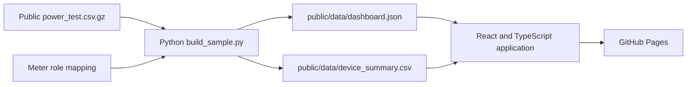

# InfraPulse 2.0

Data center energy intelligence for understanding IT load, cooling overhead, efficiency, and savings opportunities from real meter readings.

[Live application](https://aj-ing.github.io/InfraPulse_2.0/) | [Open dashboard](https://aj-ing.github.io/InfraPulse_2.0/#/dashboard) | [Dataset record](https://doi.org/10.57760/sciencedb.10792) | [Deployment workflow](https://github.com/AJ-ing/InfraPulse_2.0/actions/workflows/deploy.yml)


InfraPulse 2.0 is a deployed React application, not a Streamlit prototype. It turns a public data-center energy-meter sample into an explainable dashboard with documented calculations and a reproducible local pipeline.

## What Is Live

- Responsive landing page with dataset and methodology context.
- Interactive dashboard for IT load, cooling load, PUE proxy, daily energy, device-level comparison, data quality, and CSV export.
- Cooling-load reduction simulator that calculates the impact within the observed sample window.
- Python pipeline that downloads the public CSV when needed and writes browser-ready JSON and CSV data.
- GitHub Actions deployment to GitHub Pages on every push to `main`.

## Sample Snapshot

The committed dashboard data is generated from `power_test.csv.gz` and covers the public sample's ULC and CRAC meter readings. Timestamps are displayed exactly as recorded by the source.

| Observed metric | Value |
| --- | ---: |
| Average IT load | 14.25 kW |
| Average cooling load | 23.83 kW |
| PUE proxy | 2.673 |
| Total estimated energy | 43,908.34 kWh |
| Complete hourly observations | 1,153 |
| Recognised meter groups | 4 |

The dashboard's cost index uses a configurable sample rate of `0.18` cost units per kWh. It demonstrates the calculation only and is not an actual facility bill.

## Dataset

The MVP uses the public sample from [`cchantra/energydata`](https://github.com/cchantra/energydata), associated with the ScienceDB dataset [Energy Meter Data of Data Center in a University](https://doi.org/10.57760/sciencedb.10792).

- Source file: [`power_test.csv.gz`](https://raw.githubusercontent.com/cchantra/energydata/master/power_test.csv.gz)
- Domain: Kasetsart University data-center energy meters
- IT-load meter pattern: `UDB*_ULC_*`
- Cooling meter pattern: `ADB*_CRAC*`
- Future facility-total pattern: `DB*`

The public sample contains IT and cooling meter groups but no convenient aggregate facility meter. InfraPulse therefore reports a **PUE proxy**, never true facility PUE.

```text
PUE proxy = (IT load + cooling load) / IT load
```

True PUE requires a total-facility energy meter:

```text
True PUE = total facility energy / IT equipment energy
```

## Product Requirements

InfraPulse helps facility operators and sustainability teams answer practical questions:

- How much power is IT equipment using compared with cooling?
- When does cooling overhead rise relative to IT demand?
- Which observed meter group has the highest average or peak load?
- What could a cooling-load reduction mean within the measured window?
- Can every displayed metric be traced back to a source field and formula?

The MVP intentionally excludes authentication, live BMS/DCIM integrations, SNMP or Modbus ingestion, and any claim of true PUE without aggregate facility data.

## Stakeholders

| Stakeholder | Need | InfraPulse output |
| --- | --- | --- |
| Facility operations | See abnormal cooling and demand behaviour | Load trends, peak demand, device comparison |
| Energy management | Compare efficiency over time | IT-to-cooling view and PUE proxy |
| Finance and operations | Frame savings discussions | Sample-window savings simulator and cost index |
| Sustainability teams | Build a traceable energy story | Reproducible data pipeline and explicit methodology |
| Reviewers and contributors | Evaluate engineering decisions | Public source links, tests, typed frontend data contract |

## System Requirements

| Area | Implementation |
| --- | --- |
| Frontend | React, TypeScript, Vite, native CSS, Recharts, Phosphor icons |
| Data processing | Python standard library, `csv`, `gzip`, and `statistics` |
| Client data | Static `dashboard.json` and `device_summary.csv` under `public/data` |
| Deployment | GitHub Actions and GitHub Pages |
| Testing | Python `unittest` for meter classification and input parsing |
| Runtime | No API key, database, or backend required for the MVP |

## Input Contract

The pipeline reads the following columns from `power_test.csv.gz`:

| Source column | Required | Purpose |
| --- | --- | --- |
| `Timestamp` | Yes | Reading timestamp in the source format |
| `dev_name` | Yes | Meter identifier used to classify IT or cooling load |
| `Active_Threephase_Power` | Yes | Active power reading aggregated as kW for the dashboard |
| Electrical current, voltage, and power-factor fields | No | Available context for future analysis |

Meter classification is defined in [`data/reference/meter_mapping.csv`](data/reference/meter_mapping.csv). Unknown meter names are ignored by the current MVP rather than misclassified.

## Output Contract

| File | Consumer | Contents |
| --- | --- | --- |
| [`public/data/dashboard.json`](public/data/dashboard.json) | React dashboard | Metadata, KPI summary, hourly series, daily energy, device summaries, and data-quality fields |
| [`public/data/device_summary.csv`](public/data/device_summary.csv) | CSV download | Device role, average load, peak load, estimated energy, and observed hours |

`dashboard.json` is intentionally the frontend contract. It keeps the static site simple while retaining enough source context for a reviewer to inspect every displayed metric.

## Architecture



The raw CSV is downloaded into `data/raw/` when the pipeline runs and is ignored by Git. The processed frontend files are committed so the deployed dashboard can run without a server.

## Repository Structure

```text
InfraPulse_2.0/
├── .github/workflows/deploy.yml
├── data/reference/meter_mapping.csv
├── pipeline/build_sample.py
├── public/
│   ├── assets/
│   └── data/
│       ├── dashboard.json
│       └── device_summary.csv
├── src/
│   ├── App.tsx
│   ├── App.css
│   ├── types.ts
│   └── hooks/useDashboardData.ts
└── tests/test_build_sample.py
```

## Run Locally

Requirements: Node.js 22+ and Python 3.11+.

```bash
git clone https://github.com/AJ-ing/InfraPulse_2.0.git
cd InfraPulse_2.0
npm ci
python3 pipeline/build_sample.py
npm run test
npm run lint
npm run dev
```

Create a production build with:

```bash
npm run build
```

## Deployment

The [GitHub Pages workflow](.github/workflows/deploy.yml) builds and publishes `dist/` whenever `main` changes. Pages is configured to use GitHub Actions and the public site is available at [aj-ing.github.io/InfraPulse_2.0](https://aj-ing.github.io/InfraPulse_2.0/).

## Roadmap

1. Add aggregate `DB` meter data and calculate true PUE when it is available.
2. Support facility-specific tariffs and carbon-emissions factors.
3. Add rule-based anomaly detection and time-window comparison.
4. Integrate live DCIM, BMS, SNMP, or Modbus sources behind an authenticated backend.

## Relationship To InfraPulse v1

[InfraPulse v1](https://github.com/AJ-ing/InfraPulse) was a Streamlit-based infrastructure asset decision-support project for bridge risk scoring. InfraPulse 2.0 keeps the methodology-first, transparent decision-support approach while shifting to data-center energy intelligence and a React product experience.

## License

MIT. See [LICENSE](LICENSE).
