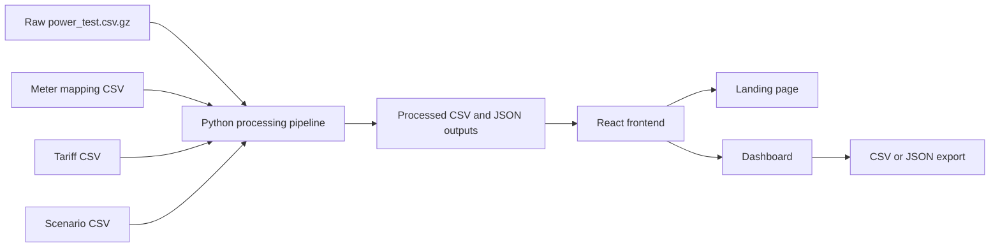

# InfraPulse 2.0

Data center energy intelligence platform for power visibility, cooling efficiency, PUE-style analysis, and savings planning.

InfraPulse 2.0 is being rebuilt as a React product instead of a Streamlit prototype. The project will have a polished landing page, a production-style analytics dashboard, and a transparent data pipeline built around real data center meter readings.

Repository status: React MVP implemented with a public landing page, interactive dashboard, reproducible data pipeline, and GitHub Pages deployment workflow.

## Current Implementation

The first release is built and deployable. It includes:

- React, TypeScript, Vite, Recharts, and Phosphor icons.
- A responsive landing page using original data-center imagery.
- A dashboard for IT load, cooling load, PUE proxy, daily energy, device comparison, data quality, CSV export, and a cooling-reduction scenario.
- A Python standard-library pipeline that converts the public compressed CSV into `public/data/dashboard.json` and `public/data/device_summary.csv`.
- Automated GitHub Pages deployment from `main` through `.github/workflows/deploy.yml`.

The raw source sample is intentionally ignored by Git. Run the pipeline locally to download it from the public source and regenerate the frontend data.

## Dataset Decision

The MVP will use the public sample data from the `cchantra/energydata` repository, which is connected to the ScienceDB data center energy-meter dataset.

Primary dataset references:

- ScienceDB dataset: [Energy Meter Data of Data Center in a University](https://doi.org/10.57760/sciencedb.10792)
- Companion/sample repository: [cchantra/energydata](https://github.com/cchantra/energydata)
- Full dataset domain: Kasetsart University data center energy meters
- Public sample file for MVP: `power_test.csv.gz`

Why this dataset fits InfraPulse 2.0:

- It is real data center energy meter data, not generic building data.
- It includes server/rack load meters: `ULC` devices.
- It includes cooling load meters: `CRAC` devices.
- The ScienceDB description also references aggregate `DB` meters, which can support true facility-level PUE if the full raw data is requested later.
- The public sample is large enough for meaningful time-series dashboard work.

Known dataset caveat:

The public sample includes ULC and CRAC meters, but does not expose the full facility aggregate DB meters in the same convenient sample. For MVP, InfraPulse 2.0 will compute a PUE-style proxy:

```text
PUE proxy = (IT load + cooling load) / IT load
```

When full aggregate DB meter data is available, the platform can compute true PUE:

```text
True PUE = total facility energy / IT equipment energy
```

## Product Vision

InfraPulse 2.0 helps facility operators and sustainability teams understand where power is going inside a data center, how efficiently cooling is supporting IT load, and what savings may be possible through operational changes.

The product should feel like a real SaaS analytics platform: clear landing page, credible methodology, interactive dashboard, and explainable calculations.

## PRD: Product Requirements Document

### Problem

Data center teams need fast answers to operational and financial questions:

- How much power are IT racks consuming?
- How much power is cooling consuming?
- Is cooling load rising faster than IT load?
- Are there abnormal spikes or inefficient operating periods?
- How much could be saved if cooling efficiency improves?
- Can stakeholders trust the calculations?

Most portfolio dashboards either hide methodology or require enterprise DCIM integrations. InfraPulse 2.0 should start with transparent CSV-based analysis and later grow into live integrations.

### Target Users

| User | Goal | Product Value |
| --- | --- | --- |
| Data center facility manager | Monitor power and cooling behavior | Detect high cooling load, spikes, and inefficient periods |
| Energy analyst | Explain consumption trends | Time-series analysis, normalized meter data, exportable metrics |
| Sustainability lead | Quantify efficiency and carbon impact | Energy intensity, estimated emissions, improvement scenarios |
| Finance or operations manager | Estimate savings | Tariff-based cost model and scenario planning |
| Engineering student or portfolio reviewer | Understand the project | Clear methodology, reproducible dataset, modern React implementation |
| Developer/contributor | Extend the system | Typed contracts, documented data pipeline, testable formulas |

### Product Goals

1. Present InfraPulse 2.0 as a credible data center energy intelligence product.
2. Build a React landing page that explains the problem, dataset, methodology, and dashboard value.
3. Build a dashboard that reads processed dataset outputs and visualizes IT load, cooling load, PUE proxy, cost, and savings scenarios.
4. Keep formulas transparent and testable.
5. Keep the MVP fully reproducible from public sample data.
6. Design the architecture so true PUE can be added when aggregate facility meter data is available.

### Non-Goals for MVP

- No real-time DCIM, BMS, SNMP, or Modbus integrations.
- No authentication or multi-tenant user accounts.
- No black-box ML model as a core requirement.
- No claim of true PUE unless total facility energy is available.
- No manual spreadsheet workflow inside the frontend.

### MVP Features

| Feature | Description | Priority |
| --- | --- | --- |
| Landing page | Product narrative, dataset credibility, feature preview, methodology summary | P0 |
| Dashboard overview | KPI tiles for IT load, cooling load, PUE proxy, cost estimate, peak demand | P0 |
| Time-series charts | IT vs cooling load over time, daily/weekly aggregation | P0 |
| Device comparison | Compare ULC and CRAC meters by average, peak, total energy, variance | P0 |
| Cooling efficiency view | Cooling-to-IT ratio and PUE proxy trend | P0 |
| Savings simulator | Estimate cost reduction from cooling load reduction or target PUE proxy | P1 |
| Anomaly flags | Rule-based spikes, missing data, zero readings, high cooling ratio | P1 |
| Methodology page | Formulas, dataset limits, PUE proxy explanation | P1 |
| CSV/JSON export | Download processed summary outputs | P2 |

### Success Metrics

- A user can understand the project from the landing page in under one minute.
- A user can identify highest cooling load periods from the dashboard.
- A user can see the difference between IT load, cooling load, and PUE proxy.
- All key metrics trace back to documented formulas.
- The app can be rebuilt from public data and local scripts.
- The frontend does not require Python at runtime after processed files are generated.

## SRD: System Requirements Document

### Functional Requirements

#### FR1: Data ingestion

The system shall ingest the public `power_test.csv.gz` sample from `cchantra/energydata`.

Expected raw fields include:

| Raw column | Meaning | Required for MVP |
| --- | --- | --- |
| `Timestamp` | Meter reading timestamp | Yes |
| `dev_name` | Device/meter name | Yes |
| `Active_Threephase_Power` | Active three-phase power reading | Yes |
| `Consumed_active_energy_kW` | Consumed active energy reading or meter-derived value | Optional |
| Current, voltage, power factor columns | Electrical context | Optional |

Observed MVP device categories:

| Device pattern | Category | Business meaning |
| --- | --- | --- |
| `UDB*_ULC_*` | `it_load` | Rack/server/IT load |
| `ADB*_CRAC*` | `cooling` | Cooling/air conditioning load |
| `DB*` | `facility_total` | Aggregate facility load, future full dataset support |

#### FR2: Normalization

The pipeline shall convert raw readings into a consistent normalized meter format.

Normalized file: `data/processed/meter_readings.csv`

| Column | Type | Description |
| --- | --- | --- |
| `timestamp` | datetime | ISO timestamp |
| `facility_id` | string | Logical facility identifier, default `ku_dc_1` for MVP |
| `meter_id` | string | Raw device name |
| `meter_role` | enum | `it_load`, `cooling`, `facility_total`, `unknown` |
| `power_kw` | number | Active power in kW |
| `energy_kwh_interval` | number | Estimated interval energy |
| `source_file` | string | Input file name |

#### FR3: Aggregation

The pipeline shall aggregate readings into frontend-ready files.

Processed outputs:

| Output | Grain | Purpose |
| --- | --- | --- |
| `time_series.json` | timestamp or resampled interval | Dashboard charts |
| `daily_summary.csv` | day | Daily KPI trend and anomaly scanning |
| `device_summary.csv` | device | Device comparison table |
| `kpi_summary.json` | portfolio/facility | Top-level KPI tiles |
| `savings_scenarios.json` | scenario | What-if simulator defaults |
| `data_quality.json` | dataset | Missing values, duplicates, coverage, anomalies |

#### FR4: Metric calculation

The system shall compute:

| Metric | Formula |
| --- | --- |
| IT power | Sum of `power_kw` where `meter_role = it_load` |
| Cooling power | Sum of `power_kw` where `meter_role = cooling` |
| Total proxy power | `it_power_kw + cooling_power_kw` |
| PUE proxy | `total_proxy_power / it_power_kw` |
| Cooling ratio | `cooling_power_kw / it_power_kw` |
| Interval energy | `power_kw x interval_hours` |
| Cost estimate | `energy_kwh x tariff_per_kwh` |
| Savings estimate | `baseline_cost - scenario_cost` |

If `facility_total` meters are available later:

| Metric | Formula |
| --- | --- |
| True PUE | `facility_total_energy_kwh / it_energy_kwh` |
| Non-IT overhead | `facility_total_energy_kwh - it_energy_kwh` |

#### FR5: Frontend landing page

The React app shall expose a landing page with:

- Hero section: product name, tagline, dataset-backed credibility, dashboard CTA.
- Problem section: power visibility, cooling overhead, savings uncertainty.
- Dataset section: ScienceDB and `cchantra/energydata` references.
- Product preview: screenshots or designed dashboard panels once built.
- Methodology section: PUE proxy now, true PUE later.
- Roadmap section: MVP, full data, live integrations.

#### FR6: Frontend dashboard

The dashboard shall include:

- Top KPI strip.
- IT vs cooling time-series chart.
- PUE proxy trend chart.
- Daily energy and estimated cost chart.
- Device comparison table.
- Savings simulator panel.
- Data quality panel.
- Methodology drawer or page.

### Non-Functional Requirements

| Requirement | Target |
| --- | --- |
| Performance | Initial dashboard load under 3 seconds with processed sample data |
| Reproducibility | Public data plus scripts can regenerate processed outputs |
| Explainability | Every KPI has a visible formula or methodology reference |
| Accessibility | Color is never the only status indicator |
| Responsiveness | Desktop-first dashboard, usable on tablet, clean mobile fallback |
| Maintainability | Data contracts are documented and tested |
| Security | No secrets or API keys required for MVP |

## Stakeholders

### Primary stakeholders

| Stakeholder | Needs | Dashboard Questions |
| --- | --- | --- |
| Facility operations team | Operational visibility | When did cooling load spike? Which equipment drives load? |
| Energy management team | Efficiency insight | How does cooling load compare to IT load? |
| Finance/management | Cost visibility | What is the estimated cost and savings potential? |
| Sustainability team | Energy and emissions story | How much energy could be reduced? What is the carbon implication later? |

### Secondary stakeholders

| Stakeholder | Needs |
| --- | --- |
| Developers | Clear contracts, scripts, tests, and architecture |
| Academic reviewers | Traceable dataset and methodology |
| Recruiters/portfolio viewers | Polished product thinking and technical execution |
| Future integrators | Path to DCIM/BMS/SNMP ingestion |

## Input Specification

### Raw MVP Input

Source file:

```text
power_test.csv.gz
```

Expected source location:

```text
https://raw.githubusercontent.com/cchantra/energydata/master/power_test.csv.gz
```

Raw sample structure:

```csv
Timestamp,dev_name,Threephase_Power_Factor,...,Active_Threephase_Power,Consumed_apparent_energy_kVAh
16/05/2018 14:41:02,UDB1_ULC_5,-0.93,...,7.40,2992.0
16/05/2018 14:41:16,UDB2_ULC_6,-0.93,...,7.36,2908.0
16/05/2018 14:41:30,ADB1_CRAC3,-0.95,...,12.10,5120.0
```

### Meter Mapping Input

File: `data/reference/meter_mapping.csv`

```csv
meter_id,meter_role,equipment_group,facility_id,display_name
UDB1_ULC_5,it_load,server_rack,ku_dc_1,ULC Rack 5
UDB2_ULC_6,it_load,server_rack,ku_dc_1,ULC Rack 6
ADB1_CRAC3,cooling,crac,ku_dc_1,CRAC 3
ADB1_CRAC4,cooling,crac,ku_dc_1,CRAC 4
```

### Tariff Input

File: `data/reference/tariffs.csv`

```csv
facility_id,currency,tariff_per_kwh,effective_from,effective_to
ku_dc_1,USD,0.12,2018-01-01,
```

The MVP can use a default tariff when no exact tariff record is provided.

### Scenario Input

File: `data/reference/scenarios.csv`

```csv
scenario_id,name,cooling_reduction_pct,target_pue_proxy,tariff_per_kwh
baseline,Baseline,0,,0.12
cooling_10,Cooling optimization 10pct,10,,0.12
target_1_60,Target PUE proxy 1.60,,1.60,0.12
```

### Validation Rules

The pipeline should reject or flag:

- Missing timestamp.
- Missing device name.
- Missing or non-numeric `Active_Threephase_Power`.
- Negative power values unless explicitly marked as meter correction events.
- Duplicate readings for the same timestamp and meter.
- Unknown meter roles.
- PUE proxy below 1.0.
- IT load equal to zero when calculating PUE proxy.

## Output Specification

### Processed Data Outputs

File: `data/processed/kpi_summary.json`

```json
{
  "facility_id": "ku_dc_1",
  "period_start": "2018-05-16T14:41:02",
  "period_end": "2018-07-10T10:21:03",
  "avg_it_kw": 14.26,
  "avg_cooling_kw": 23.84,
  "avg_total_proxy_kw": 38.10,
  "avg_pue_proxy": 2.67,
  "peak_total_proxy_kw": 78.40,
  "estimated_energy_kwh": 50120.5,
  "estimated_cost": 6014.46,
  "currency": "USD"
}
```

File: `data/processed/time_series.json`

```json
[
  {
    "timestamp": "2018-05-16T14:45:00",
    "it_kw": 14.6,
    "cooling_kw": 23.8,
    "total_proxy_kw": 38.4,
    "pue_proxy": 2.63,
    "cooling_ratio": 1.63
  }
]
```

File: `data/processed/device_summary.csv`

```csv
meter_id,meter_role,avg_kw,peak_kw,estimated_kwh,reading_count,data_coverage_pct
UDB1_ULC_5,it_load,7.15,18.08,9400.1,98068,99.1
ADB1_CRAC3,cooling,11.79,42.80,15480.4,98352,99.4
```

File: `data/processed/data_quality.json`

```json
{
  "row_count": 393107,
  "device_count": 4,
  "missing_power_rows": 2,
  "unknown_meter_rows": 2,
  "duplicate_readings": 0,
  "warnings": [
    "True PUE unavailable until aggregate facility meter data is provided."
  ]
}
```

### Frontend Output

The user-facing output should look like a polished analytics product.

#### Landing page sections

1. Hero: InfraPulse 2.0, data center energy intelligence, CTA to dashboard.
2. Problem: energy waste, cooling overhead, lack of explainability.
3. Dataset-backed proof: public data center meter dataset and sample size.
4. Product capabilities: monitor, compare, simulate, explain.
5. Dashboard preview: KPI strip and chart preview.
6. Methodology: PUE proxy now, true PUE when aggregate meters are available.
7. Roadmap: MVP, full dataset, integrations, advanced analytics.

#### Dashboard screens

| Screen | Purpose |
| --- | --- |
| Overview | Portfolio/facility KPIs and headline trends |
| Power Trends | IT vs cooling power over time |
| Cooling Efficiency | PUE proxy, cooling ratio, high overhead periods |
| Device Explorer | Meter-level comparison and data quality |
| Savings Simulator | What-if analysis for cooling reductions and target PUE proxy |
| Methodology | Dataset, formulas, assumptions, limitations |

#### Dashboard KPI tiles

- Average IT load, kW
- Average cooling load, kW
- Average PUE proxy
- Peak total proxy load, kW
- Estimated energy, kWh
- Estimated cost
- Data coverage percent
- Flagged anomaly count

## Architecture

### System Flow



### Frontend Architecture

```text
React + TypeScript + Vite
UI components
Charts
Dashboard state
Processed JSON/CSV data
```

Recommended frontend stack:

| Layer | Choice | Reason |
| --- | --- | --- |
| Framework | React + TypeScript | Strong portfolio and production fit |
| Build tool | Vite | Fast local development |
| Styling | Native CSS with design tokens | Responsive theme with no framework lock-in |
| Charts | Recharts | Interactive time-series visualizations |
| Tables | Semantic HTML table | Clear, accessible device comparison |
| Icons | Phosphor Icons | Consistent interface iconography |
| Data loading | Static JSON/CSV fetch from `public/data` | Simple MVP deployment |

### Data Pipeline Architecture

Recommended pipeline stack:

| Layer | Choice | Reason |
| --- | --- | --- |
| Language | Python 3.11+ | Reliable data processing |
| Dataframes | Python standard library | No runtime dependency beyond Python |
| Tests | unittest | Classification and parsing validation |
| Output format | JSON + CSV | Easy frontend consumption |

### Proposed Repository Structure

```text
InfraPulse_2.0/
├── README.md
├── LICENSE
├── package.json
├── index.html
├── vite.config.ts
├── tsconfig.json
├── src/
│   ├── main.tsx
│   ├── App.tsx
│   ├── App.css
│   ├── index.css
│   ├── types.ts
│   └── hooks/
│       └── useDashboardData.ts
├── public/
│   ├── assets/
│   │   ├── data-center-hero.png
│   │   └── metering-infrastructure.png
│   └── data/
│       ├── dashboard.json
│       └── device_summary.csv
├── data/
│   ├── raw/
│   │   └── power_test.csv.gz (downloaded locally and ignored by Git)
│   ├── reference/
│   │   └── meter_mapping.csv
├── pipeline/
│   └── build_sample.py
├── .github/workflows/
│   └── deploy.yml
└── tests/
    └── test_build_sample.py
```

## Calculation Methodology

### PUE Proxy

For the public sample dataset:

```text
it_kw = sum(power_kw for ULC meters)
cooling_kw = sum(power_kw for CRAC meters)
total_proxy_kw = it_kw + cooling_kw
pue_proxy = total_proxy_kw / it_kw
```

### Cooling Ratio

```text
cooling_ratio = cooling_kw / it_kw
```

### Energy Estimate

For each interval:

```text
interval_hours = minutes_between_current_and_next_reading / 60
energy_kwh_interval = power_kw x interval_hours
```

### Cost Estimate

```text
cost = energy_kwh x tariff_per_kwh
```

### Cooling Savings Scenario

```text
reduced_cooling_kw = cooling_kw x (1 - cooling_reduction_pct)
scenario_total_kw = it_kw + reduced_cooling_kw
scenario_cost = scenario_energy_kwh x tariff_per_kwh
savings = baseline_cost - scenario_cost
```

### Target PUE Proxy Scenario

```text
target_total_kw = target_pue_proxy x it_kw
target_cooling_kw = max(target_total_kw - it_kw, 0)
savings_kw = max(current_cooling_kw - target_cooling_kw, 0)
```

## Roadmap

### Phase 1: Planning and Data Contract - Complete

- Finalize README, PRD, SRD, architecture, input contracts, and output contracts.
- Select `cchantra/energydata` public sample as MVP dataset.
- Document PUE proxy limitation clearly.

### Phase 2: React Scaffold - Complete

- Create Vite React TypeScript app.
- Add landing page and dashboard route.
- Add design system basics, chart components, and responsive layout.

### Phase 3: Data Pipeline - Complete

- Download or include `power_test.csv.gz`.
- Normalize meters into role-based readings.
- Generate processed JSON/CSV files.
- Add tests for formulas and validation.

### Phase 4: Dashboard MVP - Complete

- Build KPI overview.
- Build IT vs cooling charts.
- Build PUE proxy trend.
- Build device comparison table.
- Build data quality panel.

### Phase 5: Savings and Methodology - Complete

- Add savings simulator.
- Add methodology page.
- Add formula explainers and caveats.
- Add export options.

### Phase 6: Full Dataset and True PUE

- Request or obtain full ScienceDB raw files.
- Add DB aggregate meter mapping.
- Compute true PUE where facility total energy is available.
- Keep PUE proxy as fallback when aggregate meters are missing.

### Phase 7: Future Integrations

- DCIM/BMS ingestion adapters.
- SNMP/Modbus meter ingestion.
- Scheduled pipeline runs.
- Carbon emissions factors.
- Rule-based and statistical anomaly detection.

## Acceptance Criteria

The delivered MVP satisfies these criteria:

- The React landing page is polished and explains the project clearly.
- The dashboard loads from processed JSON/CSV data.
- The pipeline regenerates all processed outputs from the raw sample file.
- IT load and cooling load are separated correctly using meter mapping.
- PUE proxy and cooling ratio are calculated and documented.
- Savings scenarios produce plausible, non-negative results.
- Data quality warnings are visible to users.
- The project can be run locally from documented commands.
- Tests cover core metric calculations.

## Local Development Plan

Run the application locally:

```bash
# install frontend dependencies
npm install

# generate or regenerate processed data
python3 pipeline/build_sample.py

# run tests
python3 -m unittest discover -s tests

# build the static production site
npm run build

# start React app
npm run dev
```

## GitHub Pages Deployment

The workflow at `.github/workflows/deploy.yml` builds and deploys the static site whenever `main` changes. In repository Settings, set Pages to use GitHub Actions if GitHub has not enabled that source automatically. The published URL is expected at `https://aj-ing.github.io/InfraPulse_2.0/`.

## Relationship to InfraPulse v1

[InfraPulse v1](https://github.com/AJ-ing/InfraPulse) was a Streamlit-based infrastructure asset decision-support system for bridge risk scoring.

InfraPulse 2.0 keeps the strongest ideas from v1:

- Transparent formulas.
- Data pipeline separated from UI.
- Methodology-first design.
- Decision-support focus.

But it changes the product direction:

- Domain changes from bridge risk to data center energy intelligence.
- UI changes from Streamlit to React.
- Dataset changes from infrastructure asset risk data to real data center energy meter readings.
- Output changes from prototype dashboard to product-style landing page plus analytics dashboard.

## License

MIT License. See [LICENSE](LICENSE).
